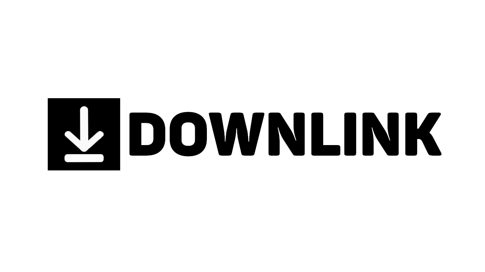

# DownLink

DownLink is a web application that allows users to download videos from YouTube and Instagram via a simple interface. This repository contains the code for both the frontend and backend of the application.

## Table of Contents

- [Features](#features)
- [Technologies](#technologies)
- [Setup](#setup)
  - [Prerequisites](#prerequisites)
  - [Installation](#installation)
- [Usage](#usage)
- [API Endpoints](#api-endpoints)
- [Contributing](#contributing)
- [License](#license)

## Features

- Download YouTube videos from a provided URL.
- Choose video quality (360p, 480p, 720p) before downloading.
- Responsive UI built with React and Tailwind CSS.
- Backend API built with Go and the Echo framework.
- Utilizes yt-dlp for downloading and ffmpeg for converting files.

## Technologies

- **Frontend**: React, Axios, Tailwind CSS
- **Backend**: Go, Echo, yt-dlp, ffmpeg
- **Containerization**: Docker, Docker Compose

## Setup

### Prerequisites

- Docker
- Docker Compose
- Node.js and npm (for frontend development)
- Python 3 (for `yt-dlp` and `ffmpeg`)

### Installation

1. **Clone the repository:**

   ```bash
   git clone https://github.com/arkorty/downlink.git
   cd downlink
   ```

2. **Set up environment variables:**

   Create a `.env.local` file in the root of the frontend directory and add the following:

   ```env
   REACT_APP_BACKEND_URL=http://localhost:8080
   ```

3. **Run the application using Docker Compose:**

   ```bash
   docker compose up --build
   ```

   This command will build and start the Docker containers for the frontend and backend.

4. **Access the application:**

   Open your browser and navigate to `http://localhost:3000` to access the frontend. The backend API will be available at `http://localhost:8080`.

## Usage

### Downloading a Video

1. Enter the video URL and select the desired quality in the form on the homepage.
2. Click the "Download" button.
3. The video will be processed and downloaded to your device.

## API Endpoints

- **GET `/downlink/`**: Check if the backend is running.
- **POST `/downlink/download`**: Submit a request to download and merge video and audio. Requires JSON body with `url` and `quality` fields.

## Contributing

We welcome contributions to DownLink! If you have suggestions, bug fixes, or new features, feel free to open an issue or submit a pull request. Thank you for helping improve DownLink!

## License

This project is licensed under the MIT License - see the [LICENSE](LICENSE) file for details.
